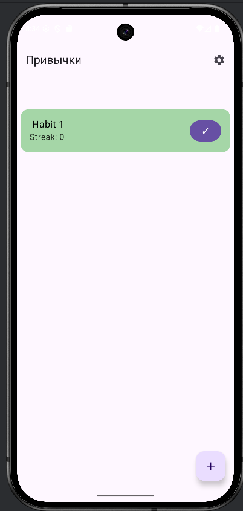
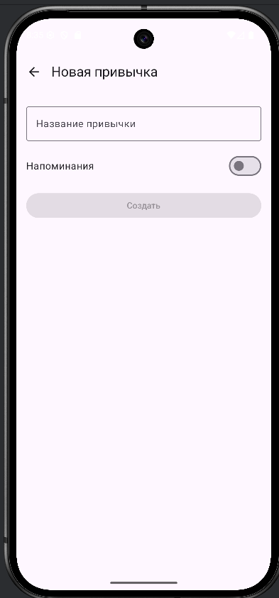
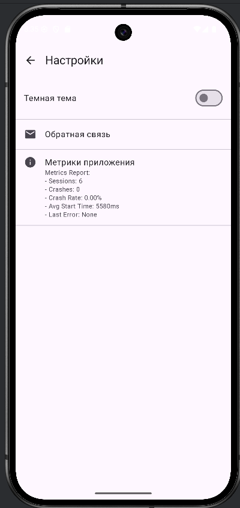
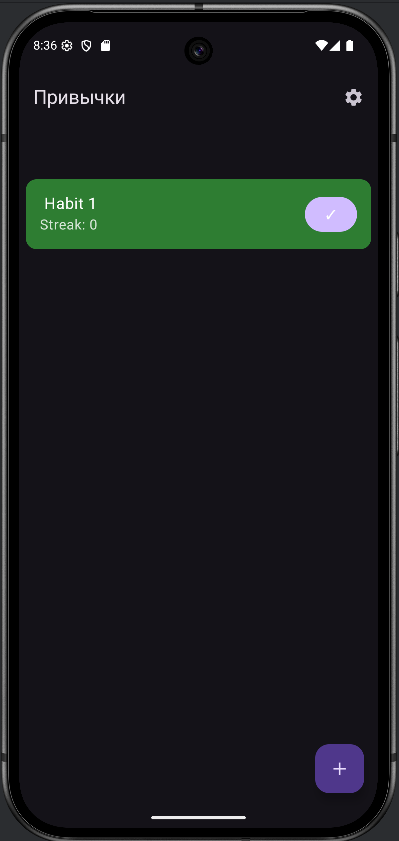
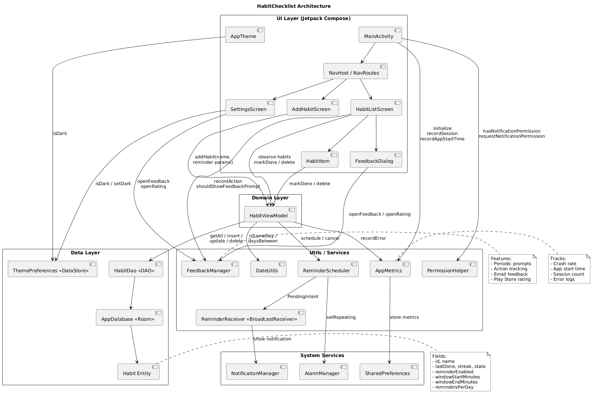

# Habit Checklist 📱

Приложение для отслеживания привычек с напоминаниями и статистикой.

## 📸 Скриншоты приложения

### Главный экран

*Список всех привычек с возможностью отметить выполнение*

### Создание новой привычки

*Экран создания новой привычки с настройками напоминаний*

### Настройки

*Экран настроек с переключением темы и обратной связью*

### Темная тема

*Приложение в темной теме*

## 🎯 Основные возможности

- ✅ Создание и управление привычками
- 🔔 Напоминания с настраиваемым временем и количеством
- 📊 Отслеживание серии (streak) выполнения
- 🌓 Поддержка светлой и темной темы
- 📈 Статистика и метрики приложения
- 💬 Система обратной связи

## 🏗️ Архитектура приложения

### Диаграмма архитектуры



*Диаграмма создана в PlantUML, исходный файл: `architecture.puml`*

### Описание архитектуры

Приложение построено по принципу **MVVM (Model-View-ViewModel)** с разделением на слои:

#### UI Layer (Jetpack Compose)
- **MainActivity**: Точка входа, настройка навигации и темы
- **NavHost**: Управление навигацией между экранами
- **Screens**: 
  - `HabitListScreen` - список привычек
  - `AddHabitScreen` - создание новой привычки
  - `SettingsScreen` - настройки приложения
- **Components**: Переиспользуемые UI компоненты (`HabitItem`, `FeedbackDialog`)

#### Domain Layer
- **HabitViewModel**: Бизнес-логика приложения
  - Управление состоянием через StateFlow
  - Обработка операций CRUD
  - Логика streak и проверка дат
  - Интеграция с ReminderScheduler

#### Data Layer
- **Room Database**: Локальное хранение привычек
  - `AppDatabase` - база данных Room
  - `HabitDao` - Data Access Object
  - `Habit` - Entity модель
- **DataStore**: Хранение настроек (тема)
  - `ThemePreferences` - управление темной темой

#### System Layer
- **ReminderScheduler**: Планирование уведомлений
  - Использует AlarmManager
  - Генерация случайных времен в заданном окне
- **ReminderReceiver**: BroadcastReceiver для показа уведомлений
- **AppMetrics**: Система мониторинга метрик
- **FeedbackManager**: Управление обратной связью

### Потоки данных

1. **Загрузка привычек**: UI → ViewModel → DAO → Database → Flow → UI
2. **Создание привычки**: UI → ViewModel → DAO → Database + ReminderScheduler
3. **Отметка выполнения**: UI → ViewModel → Проверка даты → DAO → Database
4. **Настройка темы**: UI → ThemePreferences → DataStore → MaterialTheme

### Структура проекта

```
app/src/main/java/com/example/habitchecklist/
├── data/              # Слой данных
│   ├── Habit.kt       # Модель данных привычки
│   ├── HabitDao.kt    # DAO для работы с БД
│   ├── AppDatabase.kt # Room база данных
│   └── ThemePreferences.kt # Настройки темы
├── domain/            # Бизнес-логика
│   └── HabitViewModel.kt # ViewModel
├── ui/                # UI слой
│   ├── screens/       # Экраны приложения
│   ├── components/    # Переиспользуемые компоненты
│   └── theme/        # Тема приложения
├── utils/             # Утилиты
│   ├── DateUtils.kt
│   ├── ReminderScheduler.kt
│   ├── AppMetrics.kt
│   └── FeedbackManager.kt
└── widget/            # Виджеты
```

### Технологический стек

- **Язык**: Kotlin
- **UI**: Jetpack Compose
- **Архитектура**: MVVM (Model-View-ViewModel)
- **База данных**: Room
- **Навигация**: Navigation Compose
- **Асинхронность**: Kotlin Coroutines, Flow
- **Хранение настроек**: DataStore Preferences
- **Уведомления**: AlarmManager

## 📋 Функциональность

### Управление привычками
- Создание новой привычки с названием
- Отметка выполнения (защита от дублирования в один день)
- Удаление привычки (swipe-to-delete)
- Отслеживание серии выполнения

### Напоминания
- Настройка временного окна для напоминаний
- Количество напоминаний в день (1-5)
- Случайное распределение времени в заданном окне
- Уведомления через AlarmManager

### Темы
- Светлая тема
- Темная тема
- Адаптивные цвета для карточек привычек

### Метрики и аналитика
- Отслеживание crash rate
- Время запуска приложения
- Количество сессий
- Отслеживание ошибок

### Обратная связь
- Периодические запросы обратной связи
- Кнопка обратной связи в настройках
- Интеграция с Play Store для оценок

## 🧪 Тестирование

### Unit тесты
- Тесты для `DateUtils` (проверка работы с датами)
- Тесты для логики `HabitViewModel` (streak, проверка дней)

### UI тесты
- Тесты для Compose экранов
- Проверка элементов интерфейса

Запуск тестов:
```bash
./gradlew test              # Unit тесты
./gradlew connectedAndroidTest  # UI тесты
```

## 📦 Сборка проекта

### Требования
- Android Studio Hedgehog или новее
- JDK 11 или выше
- Android SDK 24+ (минимум)
- Target SDK 36

### Установка
1. Клонируйте репозиторий
2. Откройте проект в Android Studio
3. Дождитесь синхронизации Gradle
4. Запустите на устройстве или эмуляторе

### Сборка APK
```bash
./gradlew assembleDebug    # Debug APK
./gradlew assembleRelease   # Release APK
```

APK будет находиться в: `app/build/outputs/apk/debug/app-debug.apk`

## 📊 Метрики качества

Приложение включает систему мониторинга качества:

- **Crash Rate**: Отслеживание процента крашей
- **Performance**: Время запуска приложения
- **Error Tracking**: Логирование ошибок
- **User Feedback**: Система обратной связи

Просмотр метрик: Настройки → Метрики приложения


